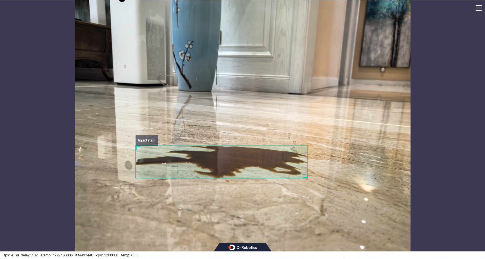

# 功能介绍

在`RDK X5`上运行websocket server和client。client端将图片发送到server端，server端经过算法推理后将图片对应的感知结果发送到client端，同时在PC的WEB端渲染图片和感知结果。

# 准备工作

## RDK X5

[参考手册](https://developer.d-robotics.cc/rdk_doc/Robot_development/quick_start/preparation)，RDK已烧录好Ubuntu系统镜像，已成功安装tros.b。

## ROS2软件包编译工具

```shell
sudo apt install ros-dev-tools
```

# 下载代码，编译和安装
```bash
# websocket server
mkdir -p /userdata/tros/src; cd /userdata/tros/src
git clone https://github.com/D-Robotics/hobot_websocket.git -b feature-interaction
cd /userdata/tros/
colcon build --packages-select websocket

# websocket client
cd /userdata/tros/src
git clone https://github.com/D-Robotics/tros_websocket_interaction.git
mkdir -p /userdata/tros/src/tros_websocket_interaction/build; cd /userdata/tros/src/tros_websocket_interaction/build
cmake ..
make -j6 && make install
cd -
```

# 运行

终端1，启动感知和websocket server：
```bash
source /opt/tros/humble/setup.bash
source /userdata/tros/install/local_setup.bash
cd /userdata/tros/src/tros_websocket_interaction
cp -r /userdata/sam/install/lib/hobot_yolo_world/config .
ros2 launch install/launch/yolo_world.launch.py smart_topic:=/hobot_yolo_world ws_port_interaction:=8081
```

终端2，启动client端，发送图片：
```bash
cd /userdata/tros/src/tros_websocket_interaction
./install/tros_websocket_client http://localhost:8081 ./config/00131.jpg
```

**注意：**如果client不是RDK X5，使用client的实际`IP`地址替换示例中的`localhost`。

# 结果展示

在PC端的浏览器输入http://IP:8000 即可查看图像和算法渲染效果（IP为RDK的IP地址）：



两个终端输出如下log：

