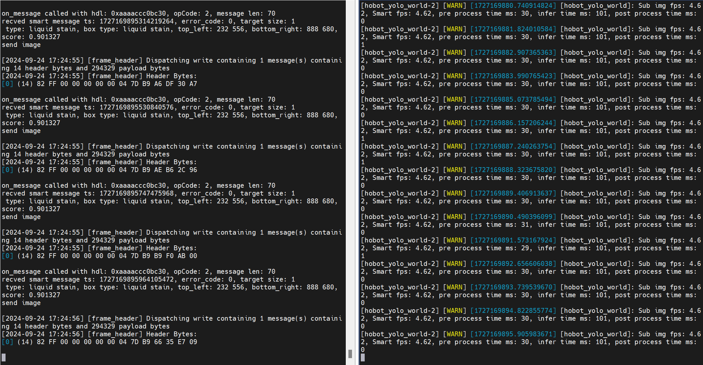

# 功能介绍

在`RDK X5`上运行websocket server和client。client端将图片发送到server端，server端经过算法推理后将图片对应的感知结果发送到client端，同时在PC的WEB端渲染图片和感知结果。

# 下载代码，编译和安装
```bash
# websocket server
mkdir -p /userdata/tros/src; cd /userdata/tros/src
git clone https://github.com/D-Robotics/hobot_websocket.git -b feature-interaction
cd /userdata/tros/
colcon build --packages-select websocket

# websocket client
cd /userdata/tros/src
git clone https://github.com/D-Robotics/tros_websocket_interaction.git
mkdir -p /userdata/tros/src/tros_websocket_interaction/build; cd /userdata/tros/src/tros_websocket_interaction/build
cmake ..
make -j6 && make install
cd -
```

# 运行

终端1，启动感知和websocket server：
```bash
source /opt/tros/humble/setup.bash
source /userdata/tros/install/local_setup.bash
cd /userdata/tros/src/tros_websocket_interaction
cp -r /opt/tros/${TROS_DISTRO}/lib/hobot_yolo_world/config/ .
ros2 launch install/launch/yolo_world.launch.py yolo_world_texts:="red bottle,trash bin" smart_topic:=/hobot_yolo_world
```

终端2，启动client端，发送图片：
```bash
cd /userdata/tros/src/tros_websocket_interaction
./install/tros_websocket_client http://192.168.3.123:8081 install/config/yolo_world_test.jpg
```

**注意：**使用实际`IP`地址替换示例中的`192.168.3.123`。

# 结果

web端浏览器显示如下：


两个终端输出如下log：

